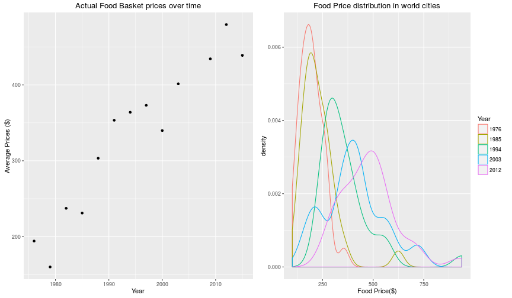
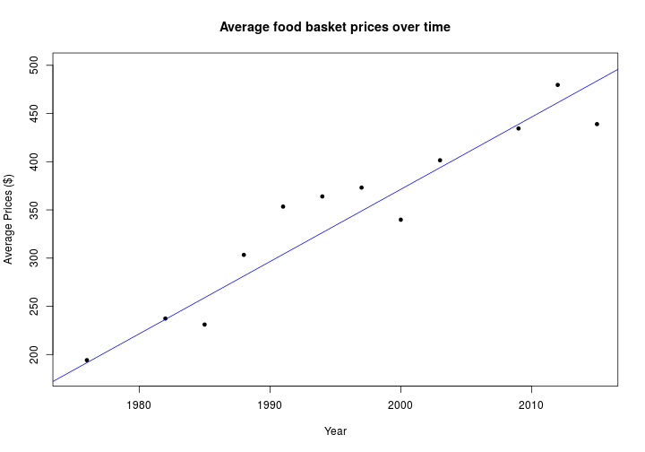

<style>
.reveal h3 { 
  color: blue;
}
.reveal .state-background {
  background: FloralWhite ;
} 
.exclaim .reveal h1,
.exclaim .reveal h2,
.exclaim .reveal p {
  color: white;
}
</style
Forecasting World Food Basket Prices 
========================================================
author: Joe Muthu
date: 14 Feb 2016
font-import: http://fonts.googleapis.com/css?family=Lato
font-family: 'Lato'
transition: fade

Introduction
========================================================

Food basket prices have been increasing steadily over the period of years and there is a need for a handy forecast of prices for various planning like home budgets,etc

A web application is created to forecast food prices based on the data gathered since 1976 from different world cities
by [UBS prices and earnings](https://www.ubs.com/microsites/prices-earnings/open-data.html). 

Forecast is only an estimation but a very **quick, useful** and **fair** estimate! 

Accuracy : Modeled on actual data!
========================================================
Based on the actual data collected by UBS, average food prices were computed out of 32 cities from 1976 to 2015 as a time series data.

Prediction Modeling 
========================================================
Used a linear model to forecast the outcome prices using the year as the predictor. 

<small>Mean squared error rate for the model is 927. </small>

Application on Shiny Server
========================================================
Application is hosted [here](https://jmuthu.shinyapps.io/shiny_project/)
- Forecasts the price for 32 cities based on the given year and also plots the results for comparison with previous years. 
- Provides necessary documentation and links for reference and further analysis.

